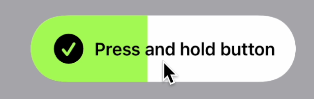

**FillUpButtonStyle**

A style to be used for a button that requires a big build up & release, for example "new habit achieved!"

When applied to a SwiftUI Button, this style:
* Sets up a pill visual style with icon + text
* Sets up the button to be reactive to press-and-hold

When pressing-and-holding, the button progressively fills up, while playing a build-up sound and increasingly strong haptic vibration.  

* If released early, it empties out.
* If held until release, it stays colored, plays a release sound, and displays a Metal 'ripple' animation to indicate success. It also passes a binding back to the original button text, so you can change the text after completion.

NOTE: the Ripple shader is by João Franco.
